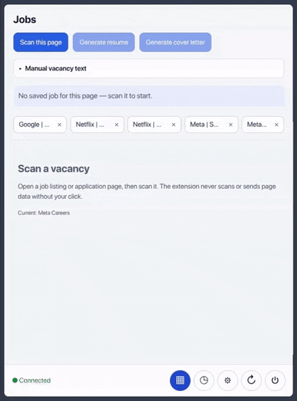

# 📄 ResuMorph

[](https://github.com/hannibalevit/resumorph/releases)
[](.github/workflows/server-ci.yml)
[](LICENSE)

> Tailor your resume and cover letter to any job posting, and answer application-form
> questions, using an LLM key you control — with your data never leaving your machine
> except for the LLM call itself.



### Contents

- [The problem](#the-problem)
- [What makes this different](#what-makes-this-different)
- [Features](#features)
- [Project status](#project-status)
- [Quick start](#quick-start)
- [Architecture](#architecture)
- [Privacy & Security](#privacy--security)
- [Roadmap & known limitations](#roadmap--known-limitations)
- [Contributing](#contributing)
- [AI-assisted development](#ai-assisted-development)
- [License](#license)
- [Support / questions](#support--questions)

<br clear="right" />

---

## The problem

Tailoring a resume for every job posting — rephrasing bullets to match the listing's
language, writing a fresh cover letter, then retyping the same "why do you want to work
here" answer into yet another application form — is repetitive manual work that most
people either skip or do badly under time pressure. ResuMorph automates that per-vacancy
tailoring loop: scan the posting, generate a tailored resume and cover letter, and draft
answers for application-form fields, without sending your resume or job data to a
third-party service that isn't the LLM provider you already chose to trust.

## What makes this different

- **Bring your own LLM key — or keep it fully local.** Supply an OpenAI, Anthropic
  (Claude), or Google Gemini API key, or point the backend at a local
  [Ollama](https://ollama.com/) instance so generation never leaves your machine.
  It's your key (or your local model), your billing, your data — nothing is proxied
  through a project-run server.
- **Local-first, by construction.** There is no ResuMorph server. You run the backend
  yourself in Docker on `localhost`. With a cloud provider, the only request that leaves
  your machine is your own backend calling that provider with your credentials. With
  Ollama pointed at a local URL, nothing needs to leave at all (a custom `baseUrl` can
  still point at another host — the Settings UI shows the effective URL).
- **Fully open-source (Apache-2.0).** The extension and backend are both auditable in
  this repository — nothing runs that you can't read.

## Features

- **Scan a job posting** — click "Scan this page" on a job listing (LinkedIn, Greenhouse,
  Lever, Ashby, Indeed, SmartRecruiters, Workable, or most other job pages) to extract
  its requirements and keywords.
- **Generate a tailored resume** — produces a `.docx` resume rewritten against that
  specific posting.
- **Generate a cover letter** — built from the same scanned posting and your latest
  tailored resume.
- **Fill application forms faster** — an inline **AI** button on non-sensitive text
  fields drafts an answer you can preview, then insert, copy, or cancel.
- **History** — past scanned vacancies and every generated artifact (resumes, cover
  letters, field answers) are kept locally so you can revisit or regenerate them.

## Project status

**Pre-release.** ResuMorph is not published on any extension store yet — it's currently
installed only as an unpacked extension via Chrome's Developer mode, from the pre-built
`extension/dist/` folder in this repository. Today it targets Chrome/Chromium (Manifest
V3) only; Firefox and Safari support are not implemented (no build target, packaging, or
store listing exists for either). Chrome Web Store publication is planned but not done —
treat this as a developer-facing preview, not a polished install-and-forget product.

## Quick start

**Prerequisites:** [Docker Desktop](https://www.docker.com/products/docker-desktop/) and
Google Chrome (or another Chromium-based browser).

1. **Start the backend**

   ```bash
   git clone git@github.com:hannibalevit/resumorph.git
   cd resumorph
   make up
   ```

   This builds the image, generates a `MASTER_ENCRYPTION_KEY` into the Docker volume on
   first run, and serves the API at `http://localhost:8000`. Verify it's up:

   ```bash
   curl http://localhost:8000/health
   ```

   You don't need to set an LLM API key yet — that happens in the extension's Settings
   panel in the next step. (If you'd rather run the backend outside Docker for
   development, see [CONTRIBUTING.md](CONTRIBUTING.md) for the `uv sync` + `.env` flow,
   which does require setting `MASTER_ENCRYPTION_KEY` and at least one LLM provider key
   by hand.)

2. **Load the extension in Chrome**

   - Open `chrome://extensions`
   - Enable **Developer mode**
   - Click **Load unpacked**
   - Select the `extension/dist` folder from this repository

3. **Configure an LLM provider**

   Open the side panel → **Settings** → enter an API key:

   | Provider | Recommended model |
   |---|---|
   | **OpenAI** | `gpt-5.4-mini` |
   | **Anthropic Claude** | `claude-sonnet-5` |
   | **Google Gemini** | `gemini-3.6-flash` |
   | **Ollama (local)** | whatever you have pulled (e.g. `llama3.2`) — no API key; Settings UI lands in a follow-up, backend API already accepts `provider=ollama` + `baseUrl` |

   → **Test connection** → **Set as Default**. Cloud provider keys are Fernet-encrypted
   before they're stored; only a masked preview is ever sent back to the extension.
   Ollama uses a configurable base URL instead of a key (default
   `http://localhost:11434`; under Docker the compose file sets
   `OLLAMA_BASE_URL=http://host.docker.internal:11434` — see [SECURITY.md](SECURITY.md)
   if Ollama only binds loopback).

## Architecture

ResuMorph is two independent projects that ship together. The **extension**
(`extension/`) is a Chrome MV3 extension built with Vite and React — a side panel UI plus
a content script that scans pages and assists form fields, only on explicit user action.
It talks over HTTP to the **backend** (`server/`), a local FastAPI service backed by
SQLite, which holds your resume, scanned job sessions, and generated artifacts, and
proxies generation requests to whichever **LLM provider** (OpenAI, Gemini, Claude, or
Ollama) you configured. No other service sits in that path. See
[CLAUDE.md](CLAUDE.md) (and its condensed counterpart [AGENTS.md](AGENTS.md)) for the
full architecture breakdown, and [CONTRIBUTING.md](CONTRIBUTING.md) for a from-source
dev setup.

## Privacy & Security

Your resume text, scanned job postings, and generated documents live in a local SQLite
database inside the Docker volume — nowhere else. Provider API keys are encrypted at
rest with Fernet (`server/app/security.py`); only a masked preview ever reaches the
extension. Cloud provider calls leave your machine only as requests your own backend
sends directly to the LLM provider you configured, using your own key. With **Ollama**
configured against a local URL, generation can stay entirely on-machine (a custom base
URL can still target another host on your LAN — treat that host as trusted).

- [PRIVACY.md](PRIVACY.md) — exactly what's stored, where, and what Chrome permissions
  are used for.
- [SECURITY.md](SECURITY.md) — threat model, scope, and known design tradeoffs.

## Roadmap & known limitations

**Known limitations today:**

- Chrome/Chromium only — no Firefox or Safari build.
- Unpacked extension install only — no Chrome Web Store (or other store) listing yet.
- The backend has no authentication; anything that can reach `http://localhost:8000` can
  read and write all local data. This is an intentional single-user local-trust design
  (see [SECURITY.md](SECURITY.md)), not an oversight.
- No cloud backup or sync — losing the Docker volume without a backup loses your data.

**Roadmap:** not yet documented publicly — track planned work via
[GitHub Issues](https://github.com/hannibalevit/resumorph/issues) and
[Releases](https://github.com/hannibalevit/resumorph/releases).

## Contributing

Contributions are welcome — bug reports, feature requests, new job-site extractors, new
LLM providers, or docs fixes. See [CONTRIBUTING.md](CONTRIBUTING.md) for local setup,
coding conventions, and the PR checklist, and [CODE_OF_CONDUCT.md](CODE_OF_CONDUCT.md)
for community guidelines.

## AI-assisted development

Parts of this codebase are developed with AI coding assistants — Claude Code
and OpenAI Codex, using the checked-in `CLAUDE.md` / `AGENTS.md` instructions
and the skills under `.claude/skills/` (see
[CONTRIBUTING.md](CONTRIBUTING.md#using-claude-code-and-other-ai-coding-agents-in-this-repo)
for what that setup looks like). Commits where Claude Code generated the code
carry a `Co-Authored-By: Claude` trailer in the commit message footer — if
that matters for your audit, search for it directly rather than by author
(the trailer is part of the message body, not the Git author field):

```bash
git log --grep 'Co-Authored-By: Claude'
```

## License

Apache License 2.0 — see [LICENSE](LICENSE).

## Support / questions

- **Bugs and feature requests:** [GitHub Issues](https://github.com/hannibalevit/resumorph/issues)
- **Security vulnerabilities:** please don't file a public issue — see
  [SECURITY.md](SECURITY.md) for private reporting instructions.

---

<div align="center">
  <sub>Built for local, private use — your resume data stays on your machine.</sub>
</div>
